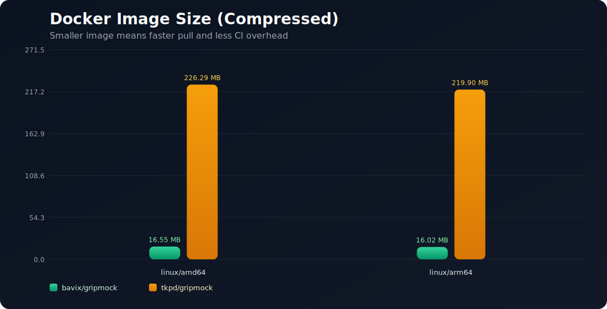
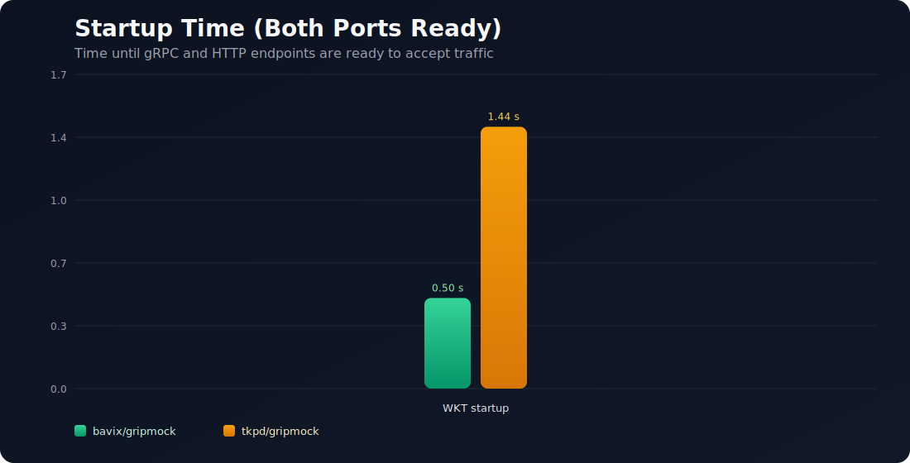
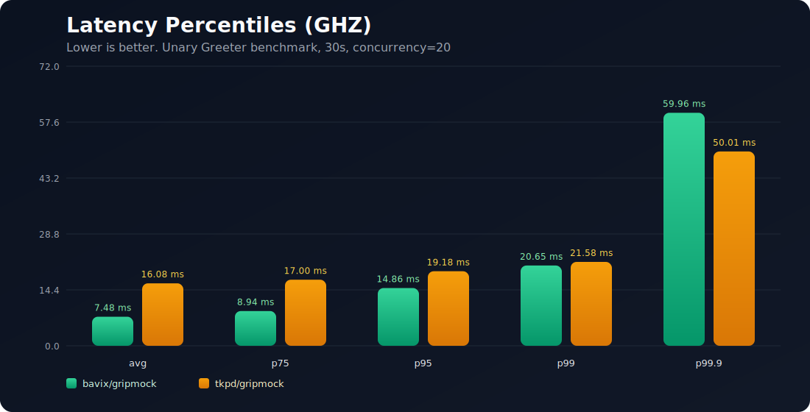
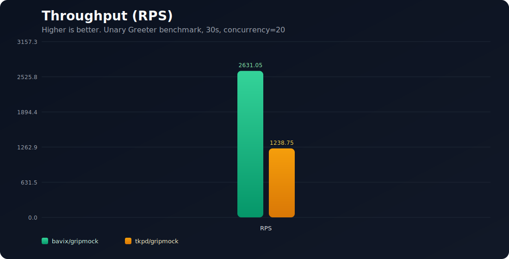

[](https://coveralls.io/github/bavix/gripmock?branch=master)
[](https://goreportcard.com/report/github.com/bavix/gripmock/v3)
[](https://opensource.org/licenses/MIT)

# GripMock 🚀

**语言版本：** [English](README.md) | 简体中文

> 提示：本页面由机器翻译生成，内容可能存在不准确或不完整之处。请以英文原文 [`README.md`](README.md) 为准。

**用于测试与开发的最快、最可靠的 gRPC Mock 服务器。**

GripMock 可以根据你的 `.proto` 文件或编译后的 `.pb` 描述文件创建 Mock 服务器，让 gRPC 测试变得简单且高效。非常适合端到端测试、开发环境和 CI/CD 流水线。


## ✨ 功能特性

- **原生运行时** - 单一进程内引擎，无需在运行时生成 gRPC 代码
- **描述来源** - 可从 `.proto`、编译后的 `.pb`、BSR 模块或 gRPC reflection 加载 API
- **动态 `.pb` 服务加载** - 可通过 API 在运行时加载编译后的 protobuf 描述文件，无需重启
- **热 Stub 管理** - 通过 API/UI 创建、更新和删除 Stub，无需重启服务
- **灵活匹配** - `equals`、`contains`、`matches`、headers、priority 和 match limits
- **数组感知匹配** - 可选的数组顺序忽略能力，减少脆弱的测试断言
- **动态模板** - 基于请求体、headers 与流上下文构建响应
- **完整 gRPC 覆盖** - Unary、服务端流、客户端流与双向流
- **错误、细节与延迟模拟** - 返回真实的 gRPC 状态码、details（`Any`）与响应时延
- **TLS 和 mTLS 支持** - 使用原生 TLS 选项运行安全的 gRPC/HTTP 测试环境
- **高级 Protobuf 类型支持** - 支持 well-known 和 extended protobuf 类型（`google.protobuf.*`、`google.type.*`）
- **YAML/JSON + Schema** - 支持两种 Stub 格式，并提供 JSON Schema IDE 校验
- **插件生态** - 使用 Go 插件扩展函数，并可与 builder 镜像标签配套
- **内置 Faker 模板** - 可在模板中直接生成真实风格的 person/contact/geo/network 测试数据（`faker.*`）
- **OpenTelemetry 链路追踪** - 支持 gRPC 与 HTTP 路径的 OTLP 追踪（`otelgrpc` + `otelhttp`）
- **Prometheus 指标（`/metrics`）** - 暴露运行时/进程指标（`go_*`、`process_*`）以及 GripMock 指标
- **运维 API** - 健康检查端点、descriptors API、stubs API 以及 Web 控制台
- **Embedded SDK（实验性）** - 在 Go 测试/服务中运行 GripMock，并提供验证助手
- **MCP API（实验性）** - 提供可流式处理的 MCP 端点，用于 Agent 与工具集成
- **Upstream Modes（实验性）** - `proxy`、`replay`、`capture` 模式，用于从真实上游服务渐进迁移到本地 mocks

## 📚 文档

**[完整文档](https://bavix.github.io/gripmock)** - 带示例的完整指南

- **Descriptor API（`/api/descriptors`）**：运行时加载编译后的 proto 描述文件（`.pb`），附带可验证的 curl 工作流：[文档](https://bavix.github.io/gripmock/guide/api/descriptors)
- **Upstream Modes（实验性）**：`proxy`、`replay`、`capture`，包含实用的上线迁移指导：[文档](https://bavix.github.io/gripmock/guide/modes)
- **Embedded SDK（实验性）**：进程内测试，支持 stubs、verification、`sdk.By(fullMethod)` 助手以及带上下文的远程校验：[文档](https://bavix.github.io/gripmock/guide/embedded-sdk)
- **Faker 参考**：内置 faker 的逐键说明与示例：[文档](https://bavix.github.io/gripmock/guide/stubs/faker)
- **OpenTelemetry + 指标**：追踪环境变量与 `/metrics` 说明：[文档](https://bavix.github.io/gripmock/guide/introduction/advanced-usage)
- **GitHub Actions（CI/CD）**：官方工作流 Action，可自动下载安装、启动、等待就绪并停止 GripMock：[文档](https://bavix.github.io/gripmock/guide/ci-cd/github-actions)

## 🧬 项目演进

GripMock 最初是 [tokopedia/gripmock](https://github.com/tokopedia/gripmock) 的一个 fork，随后演进为独立且完全重写的项目。

当前 GripMock 聚焦于实用测试工作流：

- 原生进程内架构（无需运行时代码生成）
- 灵活描述来源与运行时能力（热更新 stubs + descriptors API）
- 面向生产场景测试能力（流式、模板、upstream modes、plugins、SDK、MCP）

架构细节与基准方法见：[Performance Comparison](https://bavix.github.io/gripmock/guide/introduction/performance-comparison)

## 🖥️ Web 界面


访问 `http://localhost:4771/` 可在 Web 控制台中可视化管理 stubs。

## 🚀 快速开始

### 安装

选择你偏好的安装方式：

#### Homebrew（推荐）
```bash
brew tap gripmock/tap
brew install --cask gripmock
```

#### Shell Script
```bash
curl -s https://raw.githubusercontent.com/bavix/gripmock/refs/heads/master/setup.sh | sh -s
```

#### PowerShell（Windows）
```powershell
irm https://raw.githubusercontent.com/bavix/gripmock/refs/heads/master/setup.ps1 | iex
```

#### Docker
```bash
docker pull bavix/gripmock
```

如需构建插件，请使用配套 builder 镜像：

```bash
docker pull bavix/gripmock:v3.7.1-builder
```

#### Go Install
```bash
go install github.com/bavix/gripmock/v3@latest
```

### 基础用法

**使用 `.proto` 文件启动：**
```bash
gripmock service.proto
```

**添加静态 stubs：**
```bash
gripmock --stub stubs/ service.proto
```

**直接从 Buf Schema Registry（BSR）加载 API：**
```bash
gripmock --stub third_party/bsr/eliza buf.build/connectrpc/eliza
```

**从在线 gRPC 服务 reflection 加载 API：**
```bash
gripmock grpc://localhost:50051
gripmock grpcs://api.company.local:443
```

可选参数：
```bash
gripmock grpc://localhost:50051?timeout=10s
gripmock grpcs://10.0.0.5:8443?serverName=api.company.local
gripmock grpc://localhost:50051?bearer=<token>
```

**在 reflection 基础上使用 upstream modes（实验性）：**
```bash
# 通过 GripMock 进行纯反向代理
gripmock grpc+proxy://localhost:50051

# 本地 stubs 优先，matcher 未命中时回退上游
gripmock grpc+replay://localhost:50051

# replay + 将上游未命中自动录制为 GripMock stubs
gripmock grpc+capture://localhost:50051
```

私有 BSR 模块：
```bash
BSR_BUF_TOKEN=<token> gripmock --stub stubs/ buf.build/acme/private-api
```

自托管 BSR：
```bash
BSR_SELF_BASE_URL=https://bsr.company.local \
BSR_SELF_TOKEN=<token> \
gripmock --stub stubs/ bsr.company.local/team/payments
```

**使用 Docker：**
```bash
docker run -p 4770:4770 -p 4771:4771 \
  -v $(pwd)/stubs:/stubs \
  -v $(pwd)/proto:/proto \
  bavix/gripmock --stub=/stubs /proto/service.proto
```

- **端口 4770**：gRPC 服务
- **端口 4771**：Web UI 和 REST API

### 可观测性（v3.10.0）

```bash
OTEL_ENABLED=true \
OTEL_EXPORTER_OTLP_ENDPOINT=localhost:4317 \
OTEL_EXPORTER_OTLP_INSECURE=true \
gripmock --stub stubs/ service.proto
```

- `GET /metrics` 始终可用
- 仅在 `OTEL_ENABLED=true` 时启用追踪导出

## 🤖 GitHub Actions（CI/CD）

在 CI 流水线中使用官方 Action [`bavix/gripmock-action`](https://github.com/bavix/gripmock-action) 运行 GripMock。

```yaml
name: test

on: [push, pull_request]

jobs:
  e2e:
    runs-on: ubuntu-latest
    steps:
      - uses: actions/checkout@v5

      - name: Start GripMock
        uses: bavix/gripmock-action@v1
        with:
          source: proto/service.proto
          stub: stubs

      - name: Run tests
        run: go test ./...
```

该 Action 会：

- 从 GitHub Releases 下载 GripMock（二进制版本可用 `latest` 或固定 `version`）
- 后台启动 GripMock，并等待就绪（`/api/health/readiness`）
- 通过 outputs 暴露地址（`grpc-addr`、`http-addr`）供后续测试步骤使用
- 在 post step 自动停止 GripMock

更多示例与完整 inputs/outputs 见：[GitHub Actions 指南](https://bavix.github.io/gripmock/guide/ci-cd/github-actions)。

## 📖 示例

在 [`examples`](https://github.com/bavix/gripmock/tree/master/examples) 目录查看完整示例：

- **Streaming** - 服务端、客户端与双向流
- **File Uploads** - 分片文件上传测试
- **Real-time Chat** - 双向通信
- **Data Feeds** - 持续数据流
- **Authentication** - 基于 Header 的认证测试
- **Performance** - 高吞吐场景

### Greeter：动态 stub 演示

Stub（通用）：

```yaml
# yaml-language-server: $schema=https://bavix.github.io/gripmock/schema/stub.json
# examples/projects/greeter/stub_say_hello.yaml
- service: helloworld.Greeter
  method: SayHello
  input:
    matches:
      name: ".+"
  output:
    data:
      message: "Hello, {{.Request.name}}!"  # dynamic template lives in output
```

说明：
- 动态模板只放在 `output` 中（例如 `data`、`headers`、`stream`）。
- 保持 `input` 匹配为静态（`equals`/`contains`/`matches` 中不要使用 `{{ ... }}`）。

```bash
# 启动服务
go run main.go examples/projects/greeter/service.proto --stub examples/projects/greeter

# 通过 grpcurl 调用
grpcurl -plaintext -d '{"name":"Alex"}' localhost:4770 helloworld.Greeter/SayHello
```

期望响应：

```json
{
  "message": "Hello, Alex!"
}
```

## 🔧 Stub 配置

### 基础 Stub 示例

```yaml
service: Greeter
method: SayHello
input:
  equals:
    name: "gripmock"
output:
  data:
    message: "Hello GripMock!"
```

### 高级功能

**优先级系统：**
```yaml
- service: UserService
  method: GetUser
  priority: 100  # Higher priority
  input:
    equals:
      id: "admin"
  output:
    data:
      role: "administrator"

- service: UserService
  method: GetUser
  priority: 1    # Lower priority (fallback)
  input:
    contains:
      id: "user"
  output:
    data:
      role: "user"
```

**流式支持：**
```yaml
service: TrackService
method: StreamData
input:
  equals:
    sensor_id: "GPS001"
output:
  stream:
    - position: {"lat": 40.7128, "lng": -74.0060}
      timestamp: "2024-01-01T12:00:00Z"
    - position: {"lat": 40.7130, "lng": -74.0062}
      timestamp: "2024-01-01T12:00:05Z"
```

### 动态模板

GripMock 在 `output` 区域支持 Go `text/template` 语法的动态模板。

- 访问请求字段：`{{.Request.field}}`
- 访问请求头：`{{.Headers.header_name}}`
- 客户端流上下文：`{{.Requests}}`（接收消息切片）、`{{len .Requests}}`、`{{(index .Requests 0).field}}`
- 双向流：`{{.MessageIndex}}` 给出当前消息索引（从 0 开始）
- 数学辅助函数：`sum`、`avg`、`mul`、`min`、`max`、`add`、`sub`、`div`
- 通用函数：`json`、`split`、`join`、`upper`、`lower`、`title`、`sprintf`、`int`、`int64`、`float`、`round`、`floor`、`ceil`
- 内置 faker：`faker.Person.*`、`faker.Contact.*`、`faker.Geo.*`、`faker.Network.*`、`faker.Identity.*`

重要规则：
- 不要在 `input.equals`、`input.contains` 或 `input.matches` 中使用动态模板（匹配必须是静态的）
- 对于服务端流，如果同时设置了 `output.stream` 与 `output.error`/`output.code`，会先发送消息再返回错误；如果 `output.stream` 为空，会立即返回错误

**Header 匹配：**
```yaml
service: AuthService
method: ValidateToken
headers:
  equals:
    authorization: "Bearer valid-token"
input:
  equals:
    token: "abc123"
output:
  data:
    valid: true
    user_id: "user123"
```

## 🔍 输入匹配

GripMock 提供三种强大的匹配策略：

### 1. 精确匹配（`equals`）
```yaml
input:
  equals:
    name: "gripmock"
    age: 25
    active: true
```

### 2. 部分匹配（`contains`）
```yaml
input:
  contains:
    name: "grip"  # Matches "gripmock", "gripster", etc.
```

### 3. 正则匹配（`matches`）
```yaml
input:
  matches:
    email: "^[a-zA-Z0-9._%+-]+@[a-zA-Z0-9.-]+\\.[a-zA-Z]{2,}$"
    phone: "^\\+?[1-9]\\d{1,14}$"
```

## 🛠️ API

### REST API 端点

- `GET /api/stubs` - 列出所有 stubs
- `POST /api/descriptors` - 在运行时加载 protobuf descriptor set（`FileDescriptorSet`）
- `POST /api/stubs` - 添加新 stub
- `POST /api/stubs/search` - 查找匹配的 stub
- `DELETE /api/stubs` - 清空所有 stubs
- `GET /api/health/liveness` - 健康检查
- `GET /api/health/readiness` - 就绪检查

### API 使用示例

```bash
# Add a stub
curl -X POST http://localhost:4771/api/stubs \
  -H "Content-Type: application/json" \
  -d '{
    "service": "Greeter",
    "method": "SayHello",
    "input": {"equals": {"name": "world"}},
    "output": {"data": {"message": "Hello World!"}}
  }'

# Search for matching stub
curl -X POST http://localhost:4771/api/stubs/search \
  -H "Content-Type: application/json" \
  -d '{
    "service": "Greeter",
    "method": "SayHello",
    "data": {"name": "world"}
  }'
```

## 📋 JSON Schema 支持

为 stub 文件添加 schema 校验以获得 IDE 支持：

**JSON 文件：**
```json
{
  "$schema": "https://bavix.github.io/gripmock/schema/stub.json",
  "service": "MyService",
  "method": "MyMethod"
}
```

**YAML 文件：**
```yaml
# yaml-language-server: $schema=https://bavix.github.io/gripmock/schema/stub.json
service: MyService
method: MyMethod
```

## 🌐 BSR 集成

GripMock 支持与 Buf Schema Registry 的简化集成：

### 配置

```bash
# Public BSR (default)
BSR_BUF_BASE_URL=https://buf.build
BSR_BUF_TOKEN=<token>

# Self-hosted BSR
BSR_SELF_BASE_URL=https://bsr.company.local
BSR_SELF_TOKEN=<token>
```

### 使用

```bash
# Public module
gripmock buf.build/connectrpc/eliza

# Self-hosted module
gripmock bsr.company.local/team/payments:main

# With stubs
gripmock --stub stubs/ bsr.company.local/team/payments
```

### 路由

GripMock 会自动路由模块：
- `buf.build/owner/repo` → 使用 Buf profile
- `bsr.company.local/owner/repo` → 使用 Self profile

详情见 [BSR Documentation](https://bavix.github.io/gripmock/guide/sources/bsr)。

## 🔎 gRPC Reflection Source

GripMock 支持通过以下端点 scheme 从 gRPC reflection 加载 descriptors：

- `grpc://host:port`（不安全）
- `grpcs://host:port`（TLS）

支持的 query 参数：

- `timeout`（默认 `5s`）
- `bearer`（Authorization token）
- `serverName`（TLS SNI override）

示例：

```bash
gripmock grpc://localhost:50051
gripmock grpcs://api.company.local:443
gripmock grpcs://10.0.0.5:8443?serverName=api.company.local
```

完整指南：[gRPC Reflection Source](https://bavix.github.io/gripmock/guide/sources/grpc-reflection)。

## 🔁 Upstream Modes（实验性）

⚠️ **实验性功能**：Upstream modes 可能在未提前通知的情况下变更。

Upstream modes 叠加在 reflection sources 之上，定义运行时行为：

- `proxy` - 纯反向代理
- `replay` - 本地优先 + 上游回退
- `capture` - replay + 从上游自动录制 stub

模式指南：

- [Upstream Modes Overview](https://bavix.github.io/gripmock/guide/modes)
- [Proxy Mode](https://bavix.github.io/gripmock/guide/modes/proxy)
- [Replay Mode](https://bavix.github.io/gripmock/guide/modes/replay)
- [Capture Mode](https://bavix.github.io/gripmock/guide/modes/capture)

## 📊 基准图表






## 🔗 有用资源

- 📖 **[Documentation](https://bavix.github.io/gripmock)** - 完整指南与示例
- 🧪 **[Testing gRPC with Testcontainers](https://medium.com/skyro-tech/testing-grpc-client-with-mock-server-and-testcontainers-f51cb8a6be9a)** - 文章作者 [@AndrewIISM](https://github.com/AndrewIISM)
- 📋 **[JSON Schema](https://bavix.github.io/gripmock/schema/stub.json)** - Stub 校验 schema
- 🔗 **[OpenAPI](https://bavix.github.io/gripmock-openapi/)** - REST API 文档

## 🤝 参与贡献

欢迎贡献！详情请见我们的 [Contributing Guide](CONTRIBUTING.md)（中文版：[CONTRIBUTING.zh-CN.md](CONTRIBUTING.zh-CN.md)）。

## 📄 许可证

本项目基于 **MIT License**，详见 [LICENSE](LICENSE) 文件。

---

**由 GripMock 社区用 ❤️ 打造**
